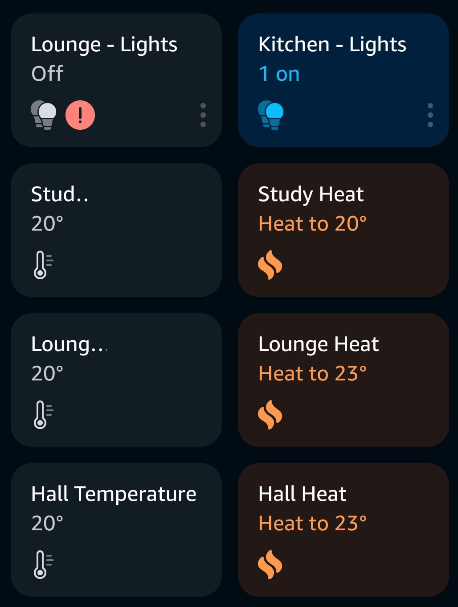
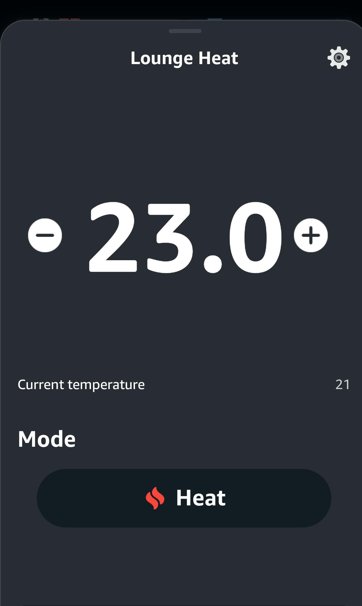
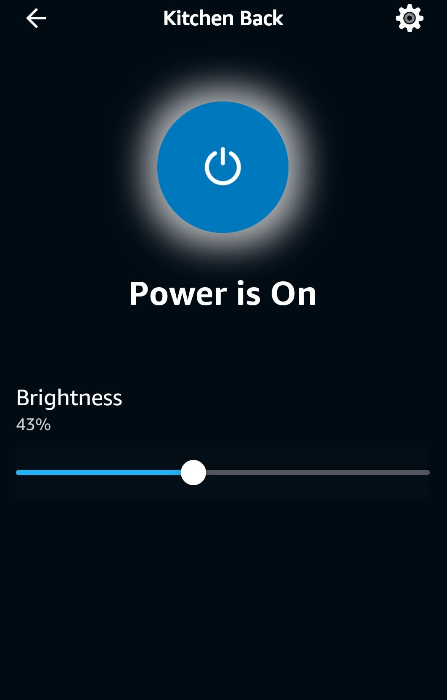

# IdratekAlexa
Alexa Skill to interface with Idratek web

So far it works with dimmers and heating part of HVAC.
Deals with disovery, status and supports commands like:
"Alexa, kitchen lights 30%"
"Alexa, lights off"
"Alexa, make it warmer in here"
"Alexa, set the study to 18 degrees"

It also works quite well with the Alexa App
  

This is set up to be hosted in lambda. and requires 3 Environment variables to allow access to idreatek web server.
HOST_IP = exposed IP address
HOST_UNAME = idratek web username (must have web API permissions to objects)
HOST_UPASS = password

Log in to the Alexa developer console
Create a new skill (smart home)
use the lamda ARN as the endpoint.

